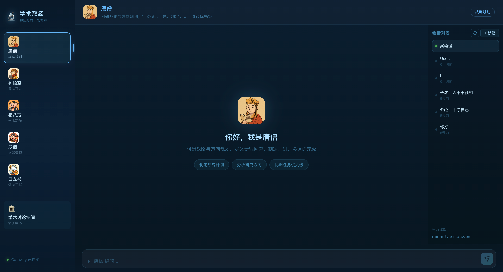

# 🔬 WestOdyssey：一个面向科研攻关的智能协作系统

- 基于 OpenClaw + Vue3 的多智能体科研协作平台
- 基于 Vue 3 + Vite + TypeScript + Pinia 构建的多智能体科研协作系统前端。

## 📋 项目概述

本项目构建了一个面向 AI/ML 研究人员的**多智能体科研协作系统**，集成 5 个专业智能体，覆盖从文献调研到论文审稿的完整科研工作流。


### 核心特性

- 🤖 **5 个专业 Agent**：唐僧、孙悟空、猪八戒、沙僧、白龙马
- 🤖 **唐 僧**：科研战略与方向规划 Agent
- 🤖 **孙悟空**：算法开发与编程实现 Agent
- 🤖 **猪八戒**：学术写作与项目申报 Agent
- 🤖 **沙 僧**：文献管理与知识整合 Agent
- 🤖 **白龙马**：数据工程与流程自动化 Agent
- 🌊 **会话分页**：可以根据不同的任务需求与同一个 Agent 建立分页对话
- 📝 **动态输入**：在与 Agent 对话过程中，可以随时停止当前任务
- 💬 **独立会话**：每个 Agent 维护独立的对话历史
- 🎨 **现代 UI**：深色主题科研工作室界面



## 系统架构

```
浏览器 (ui)                  OpenClaw Gateway
┌──────────────┐   HTTP/SSE   ┌──────────────────────┐
│ Vue3 SPA     │ ──────────── │ :18789               │
│ :8001 (dev)  │  /v1/chat/   │ ┌──────────────────┐ │
│ :8080 (prod) │  completions │ │ sanzang (唐僧)    │ │
│              │              │ │ wukong  (孙悟空)  │ │
│  NavBar      │  Headers:    │ │ wuneng  (猪八戒)  │ │
│  AgentChat   │  Agent-Id    │ │ wujing  (沙僧)    │ │
│  GroupChat   │  Session-Key │ │ horse   (白龙马)   │ │
│  ChatInput   │  Bearer xxx  │ │ coordinator       │ │
└──────────────┘              └──────────────────────┘
```

## 前置条件

- Node.js >= 18
- npm >= 9
- OpenClaw 已安装 (`openclaw` 命令可用)

## 🤖 5 个智能体

| Agent | 名称 | 功能 | @提及 |
|-------|------|------|-------|
| 📚 | 唐僧 | 定义研究问题与科学目标、制定阶段性计划 | `@讨论` `@discussion` `@dis` |
| 🧪 | 孙悟空 | 实验设计、模型训练、超参调优 | `@实验` `@experiment` `@exp` |
| ✍️ | 猪八戒 | 论文撰写、LaTeX、学术润色 | `@写作` `@writer` `@wrt` |
| 🔍 | 沙僧 | 检索文献、领域综述、定时总结 | `@文献` `@literature` `@lit` |
| 📊 | 白龙马 | 数据清洗、特征工程、可视化 | `@数据` `@data` `@dat` |


## 一、配置 OpenClaw

### 1. 合并 Agent 配置

将 `openclaw_config/openclaw.json` 中的配置合并到你的 `~/.openclaw/openclaw.json`。

关键配置项：

```jsonc
{
  "agents": {
    "list": [
      { "id": "sanzang",     "name": "唐僧",   "workspace": "..." },
      { "id": "wukong",      "name": "孙悟空", "workspace": "..." },
      { "id": "wuneng",      "name": "猪八戒", "workspace": "..." },
      { "id": "wujing",      "name": "沙僧",   "workspace": "..." },
      { "id": "horse",       "name": "白龙马", "workspace": "..." },
      { "id": "coordinator", "name": "学术讨论空间", "workspace": "..." }
    ]
  },
  "gateway": {
    "port": 18789,
    "auth": {
      "mode": "token",
      "token": "<你的 token>"          // ui 需要用这个 token 连接
    },
    "http": {
      "endpoints": {
        "chatCompletions": { "enabled": true }   // 必须开启
      }
    }
  }
}
```

### 2. 启动 Gateway

```bash
openclaw gateway start
```

验证 Gateway 是否正常运行：

```bash
curl -s http://localhost:18789/v1/models \
  -H "Authorization: Bearer <你的token>" | head -20
```

## 二、开发模式部署（推荐调试）

```bash
cd ./WestOdyssey

# 安装依赖
npm install

# 启动开发服务器
npm run dev
```

访问 **http://localhost:8001**

Vite 开发服务器已在 `vite.config.ts` 中配置代理，`/v1/*` 请求自动转发到 `http://localhost:18789`（Gateway），无需额外配置跨域。

### 自定义 Gateway Token

在 `ui/` 目录创建 `.env` 文件：

```bash
VITE_OPENCLAW_AUTH_TOKEN=<你的 token>
```


如不配置，将使用 `useStream.ts` 中的默认值。

## 三、生产构建部署

### 方案 A：Nginx 反向代理（推荐）

#### 1. 构建

```bash
cd ./WestOdyssey
npm run build
```

产出 `dist/` 目录。

#### 2. Nginx 配置

```nginx
server {
    listen 8080;
    server_name localhost;

    root /path/to/WestOdyssey/dist;
    index index.html;

    # SPA 路由回退
    location / {
        try_files $uri $uri/ /index.html;
    }

    # 反向代理 Gateway API
    location /v1/ {
        proxy_pass http://127.0.0.1:18789;
        proxy_set_header Host $host;
        proxy_set_header X-Real-IP $remote_addr;
        proxy_buffering off;           # SSE 流式响应必需
        proxy_cache off;
        chunked_transfer_encoding on;
    }
}
```

```bash
# 测试并重载 Nginx
nginx -t && nginx -s reload
```

访问 **http://localhost:8080**

#### 关键提示

- `proxy_buffering off` 是 SSE 流式响应的必需配置，否则会出现消息延迟
- 如果 Gateway 和 Nginx 不在同一台机器，将 `127.0.0.1` 改为 Gateway 实际 IP

### 方案 B：Vite Preview（快速预览）

```bash
cd ./WestOdyssey
npm run build
npm run preview    # 默认端口 4173
```

> 注意：preview 模式不带 API 代理，需配合 Nginx 或将 Gateway 配置为允许跨域。

## 四、远程服务器部署

如果 ui 和 Gateway 分别部署在不同机器：

1. Gateway 端：修改 `openclaw.json` 中 `gateway.bind` 为 `"0.0.0.0"` 或具体 IP
2. ui 端：修改 `vite.config.ts` 中 proxy target 或 Nginx 中 `proxy_pass` 为远程 Gateway 地址

```jsonc
// ~/.openclaw/openclaw.json
{
  "gateway": {
    "bind": "0.0.0.0"    // 允许远程连接（注意安全性）
  }
}
```

## 五、通信协议说明

ui 通过标准 OpenAI 兼容 HTTP API 与 Gateway 通信：

```
POST /v1/chat/completions

Headers:
  Content-Type: application/json
  Authorization: Bearer <token>
  X-OpenClaw-Agent-Id: sanzang          # 路由到指定 Agent
  X-OpenClaw-Session-Key: agent:sanzang:main:webchat-user:default:<session-id>

Body:
  {
    "model": "openclaw:sanzang",
    "messages": [{"role":"user","content":"..."}],
    "stream": true
  }
```

- `X-OpenClaw-Agent-Id` 决定消息由哪个 Agent 处理
- `X-OpenClaw-Session-Key` 保证会话隔离
- `stream: true` 启用 SSE 流式输出

## 六、项目结构

```
WestOdyssey/
├── index.html                # 入口 HTML
├── package.json
├── vite.config.ts            # Vite 配置（含 Gateway 代理）
├── tsconfig.json
├── src/
│   ├── main.ts               # Vue 应用入口
│   ├── App.vue               # 主布局（NavBar + 视图切换）
│   ├── stores/
│   │   ├── agents.ts         # Agent 定义（5+1 角色）
│   │   └── chat.ts           # Pinia 状态管理
│   ├── composables/
│   │   └── useStream.ts      # SSE 流式请求封装
│   ├── views/
│   │   ├── AgentChat.vue     # 单 Agent 聊天页
│   │   └── GroupChat.vue     # 学术讨论空间页
│   ├── components/
│   │   ├── NavBar.vue        # 左侧导航栏
│   │   ├── ChatMessage.vue   # 消息气泡（Markdown 渲染）
│   │   ├── ChatInput.vue     # 输入框
│   │   └── SessionList.vue   # 会话列表面板
│   └── styles/
│       └── global.css        # 全局暖色调样式
└── dist/                     # 构建产物（npm run build 后生成）
```

## 七、常见问题

| 问题 | 原因 | 解决 |
|------|------|------|
| 消息发送后无响应 | Gateway 未启动或 token 错误 | 检查 `openclaw gateway start` 状态及 token |
| 流式输出一次性返回 | Nginx 未关闭 buffering | 添加 `proxy_buffering off` |
| 页面白屏 | 构建产物路径配置错误 | 检查 Nginx root 路径 |
| Agent 返回 404 | `openclaw.json` 中 agent id 不匹配 | 确保 id 为 sanzang/wukong/wuneng/wujing/horse/coordinator |
| 跨域错误 | 生产环境未配置反向代理 | 使用 Nginx 代理 `/v1/` 到 Gateway |

## 八、快速启动清单

```bash
# 1. 启动 Gateway
openclaw gateway start

# 2. 安装依赖并启动 ui
cd ./WestOdyssey
npm install
npm run dev

# 3. 打开浏览器
open http://localhost:8001
```
